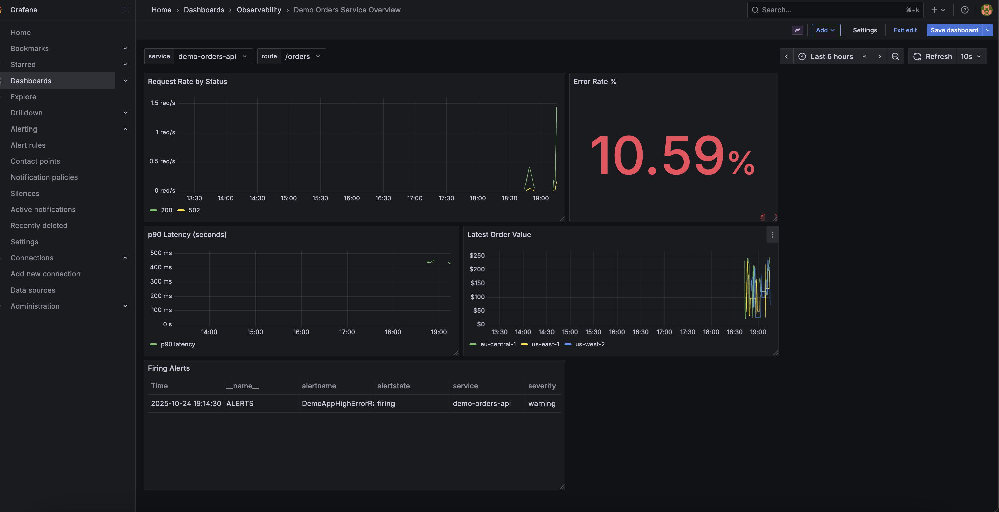
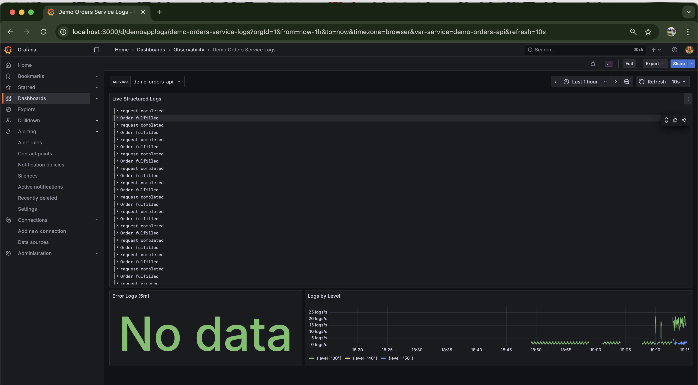

# Introduction
Project on Prometheus + Loki + Grafana (PLG) observability lab with a Node.js demo service and a Python metrics exporter. Everything runs locally with Docker Compose so we can explore metrics, logs, and alerts without extra infrastructure.

---

## Highlights
- Complete PLG stack with pre-provisioned Grafana datasources and dashboards
- Demo Orders API emitting Prometheus metrics and structured JSON logs
- Synthetic order exporter that simulates business KPIs the API consumes
- Alertmanager webhook into the API to exercise end-to-end alert flows
- Operators’ runbook with triage steps and useful queries (`docs/runbook.md`)

---

## Screenshots
<div align="center">
  
  <br />
  <em>Grafana metrics dashboard highlighting request/error rate, latency, and exporter data.</em>
  <br /><br />
  
  <br />
  <em>Grafana logs dashboard powered by Loki with structured filters and error counters.</em>
</div>

---

## Prerequisites
- Docker Engine ≥ 24
- Docker Compose plugin
- `curl` (or any HTTP client) for test traffic

> Promtail reads container logs through `/var/run/docker.sock` and `/var/lib/docker/containers`. Make sure your user has permission to access these paths (Linux users should belong to the `docker` group or run the stack with elevated privileges).

---

## Quick Start
1. **Start the stack**

   ```bash
   docker compose up -d --build
   ```

   The compose file builds the local images (`demo-orders-api`, `demo-order-exporter`) and pulls `latest` images for the upstream services.

2. **Open the UIs**

   - Grafana → http://localhost:3000 (login: `admin` / `grafana_admin`)
   - Prometheus → http://localhost:9090
   - Alertmanager → http://localhost:9093
   - Demo Orders API → http://localhost:8080/orders

3. **Generate traffic**

   ```bash
   for i in $(seq 1 200); do curl -s http://localhost:8080/orders > /dev/null; done
   ```

   Leave a loop running for 60–90 seconds to build error ratios and trigger alerts.

4. **Explore observability**

   - Grafana › Observability › **Demo Orders Service Overview** (metrics)
   - Grafana › Observability › **Demo Orders Service Logs** (Loki log stream)

---

## Stack Map
| Service | Purpose | Port (host) |
| --- | --- | --- |
| demo-app | Node.js API with Prometheus metrics & webhook endpoint | 8080 |
| order-exporter | Python exporter generating synthetic KPIs | 9100 |
| prometheus | Metrics scraper, alert engine | 9090 |
| alertmanager | Alert delivery via webhook | 9093 |
| loki | Log storage backend | 3100 |
| promtail | Log shipper discovering Docker containers | — |
| grafana | Dashboards for metrics/logs | 3000 |

Configuration for each component lives under its own directory and mounts read-only into the container.

---

## Alerts
Prometheus loads rules from `prometheus/alerting_rules.yml`:

| Alert | Condition | Notes |
| --- | --- | --- |
| `DemoAppHighErrorRate` | Error ratio ≥ 10% for ≥ 1 minute (2-minute lookback) | Fires during sustained failures; view in Grafana panel “Firing Alerts”. |
| `OrderExporterStaleData` | Exporter snapshot older than 120 seconds | Demonstrates freshness monitoring for a dependency. |

Alertmanager forwards events to `POST /alert` on the demo app. Check the API logs (`event="alertmanager.webhook"`) to confirm delivery.

To force `DemoAppHighErrorRate`, keep the traffic loop running ~90 seconds so the error ratio stays above 10%.

---

## Dashboards & Queries
Grafana provisioning (`grafana/provisioning/`) loads:
- **Demo Orders Service Overview** (`grafana/dashboards/demo-app-overview.json`): request rates, error %, p90 latency, exporter values, firing alerts table.
- **Demo Orders Service Logs** (`grafana/dashboards/demo-app-logs.json`): live log stream with filters, error counts, and rates by log level.

Handy Prometheus/Loki queries are captured in `docs/runbook.md` alongside troubleshooting steps.

---

## Troubleshooting
- **Grafana cannot talk to Loki** → Ensure `loki/config.yml` matches the latest single-binary schema (already provided) and the container is healthy (`docker compose logs loki`).
- **Alerts not firing** → Verify Prometheus reloaded rules (`docker compose logs prometheus`) and keep test traffic running long enough to satisfy the `for` clause.
- **Promtail permission errors** → Restart the stack with sufficient permissions or adjust the Docker socket access.
- **Reset state** → `docker compose down -v` removes persisted data volumes if you want a clean slate.

---

## Project Layout
```
.
├── README.md
├── docker-compose.yml
├── alertmanager/
├── demo-app/
├── exporters/
├── grafana/
├── loki/
├── prometheus/
├── promtail/
└── docs/
```

`docs/runbook.md` serves as the operator guide once the stack is live.

---

## Author

Anubhav Mandarwal ([Anubhav Mandarwal](https://www.linkedin.com/in/anubhav-mandarwal/))
